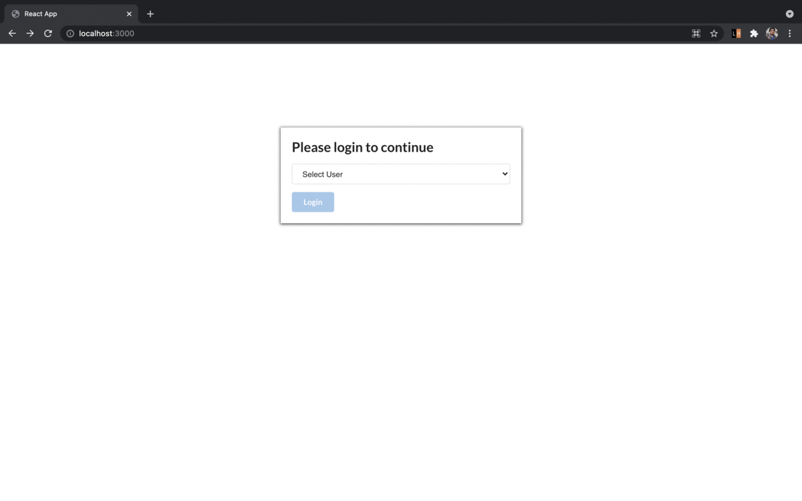

# Preview

 / 

# Introduction
This a web app that lets a user play the “Would You Rather?” game. The game goes like this: A user is asked a question in the form: “Would you rather [option A] or [option B] ?”. Answering "neither" or "both" is against the rules.

In this app, users will be able to answer questions, see which questions they haven’t answered, see how other people have voted, post questions, and see the ranking of users on the leaderboard.

# Steps to run this project

Clone this repo and install necessary dependencies 
### `https://github.com/xlsarath/would-you-rather.git`
### `cd would-you-rather`
### `npm install`
### `npm start`

Open [http://localhost:3000](http://localhost:3000) to view it in the browser.

